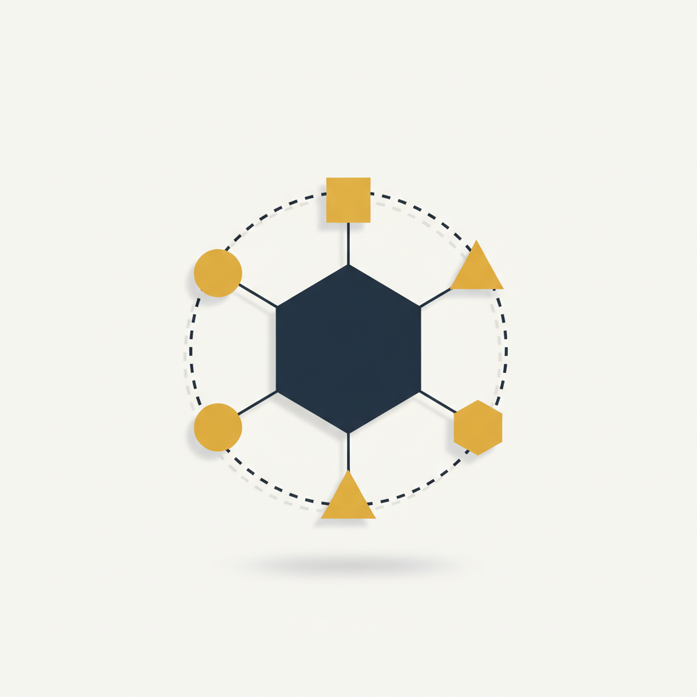

<p align="center">
  
</p>

<h1 align="center">Symposium</h1>

<p align="center">
  <em>An opinionated protocol for structured, sequential, adversarial multi-agent deliberation.</em>
</p>

<p align="center">
  <a href="docs/specification.md"></a>
  <a href="docs/schemas/v1.0.0/"></a>
  <a href="symposium/"></a>
  <a href="https://github.com/terrordrummer/symposium/actions/workflows/validate.yml"></a>
  <a href="LICENSE"></a>
</p>

---

## What is this?

Symposium is a **protocol specification** + a **reference Python
runtime** that orchestrates a small panel of LLM-backed agents through
a structured, turn-based deliberation, producing a single, replayable,
schema-validated artifact.

It is **not** a generic agent framework. It enforces exactly one
conversation topology — fixed panel, one primary turn per agent per
round, one structurally-separated coordinator, bounded forks — and
trades topology flexibility for **testable scheduler invariants** and
**byte-identical replay** of any past session.

Two things ship together in this repo:

1. **`docs/specification.md`** — the normative protocol. Implementable
   in any language. The spec is what conformance means.
2. **`symposium/`** — the reference Python runtime. Today: full
   scheduler, persistence, replay, the deterministic `FakeProvider`
   adapter, an OpenAI-shaped HTTP adapter (real OpenAI plus
   self-hosted OpenAI-compatible endpoints), and an Anthropic-shaped
   HTTP adapter (real Anthropic plus self-hosted Anthropic-compatible
   endpoints).

---

## Why one more protocol?

Most multi-agent stacks expose enough flexibility (group chat,
arbitrary handoffs, nested supervisors) that any two implementations
diverge on the parts that matter — when does the conversation stop, what
exactly is replayed, what fails the run, how is delegation routed. Each
implementation invents its own answers, and operators end up debugging
the framework instead of the agents.

Symposium goes the opposite way: **one opinionated topology, sharp
boundaries, closed enums.** What you get in exchange:

| | Symposium |
|---|---|
| **Topology** | Fixed `deliberation_panel`, one `primary_turn` per agent per round, single `coordination_turn` from a structurally-separated `coordinator_agent`. |
| **Inter-agent routing** | Schema-validated `direct_request` only. Inline `@AgentName` in prose is never routing — prompt-injection resistant by construction. |
| **Roles** | Three-way separation: `Selector` chooses *who*, `CoordinatorAgent` recommends *what next* (LLM, no executive power), `OrchestratorRuntime` schedules and terminates (deterministic code, sole party that decides when a session stops). |
| **Failure surface** | Closed 7-value termination-reason enum; closed 12-value adapter `error.kind` enum; closed 3-value `on_agent_failure` policy. |
| **Replayability** | Four distinct contracts documented separately: `transcript_replay` (unconditional byte identity), `execution_replay` (conditional on ten pinning conditions), golden-test byte identity, `fake_provider` determinism. No "it should be deterministic" hand-waving. |
| **Persistence** | Canonical `Artifact` (§5.10) with RFC-8785 JCS-canonicalized `transcript_digest` (SHA-256). Tamper-evident. |
| **Execution mode** | MVP is **batch-only** (ADR-004). Interactive / event-stream / async are explicitly v1+. |

Full discussion in §10 *Competitive Positioning* of the spec.

---

## Quick start

The reference runtime ships three adapters out of the box: the
deterministic `FakeProvider` (for tests and reproducible demos), an
OpenAI-shaped HTTP adapter (for real-model sessions against
`api.openai.com` or any OpenAI-Chat-Completions-compatible endpoint),
and an Anthropic-shaped HTTP adapter (for real-model sessions against
`api.anthropic.com` or any Anthropic-Messages-compatible endpoint).
Every flow produces a persisted, byte-identically replayable artifact.

```bash
# Install (editable, while the package is pre-PyPI)
git clone https://github.com/terrordrummer/symposium
cd symposium
pip install -e .
```

### Fake-driven session (no API key, no network)

```bash
symposium run \
  --config examples/configs/walking-skeleton.yaml \
  --script examples/scripts/walking-skeleton.json \
  --output runs/ \
  examples/problem.md

# Replay (byte-identity check on the stored canonical_transcript)
symposium replay runs/demo-walking-skeleton-001

# Validate the artifact against the v1.0.0 JSON Schemas
symposium validate runs/demo-walking-skeleton-001/artifact.json
```

### OpenAI-driven session

```bash
export OPENAI_API_KEY=sk-...
# Optional: point at a self-hosted OpenAI-compatible endpoint
# export OPENAI_BASE_URL=https://my-llm-proxy.internal/v1

symposium run \
  --config examples/configs/openai.yaml \
  --output runs/ \
  examples/problem.md
```

### Anthropic-driven session

```bash
export ANTHROPIC_API_KEY=sk-ant-...
# Optional: point at a self-hosted Anthropic-compatible endpoint
# export ANTHROPIC_BASE_URL=https://my-llm-proxy.internal/v1

symposium run \
  --config examples/configs/anthropic.yaml \
  --output runs/ \
  examples/problem.md
```

### Inspecting metrics

Every persisted run directory can be analysed offline with `symposium
metrics`, which computes the §7.9 MVP observability set (token / cost
usage per agent and per `(provider, model)`, latency per invocation,
participation per round, branch depth, deferred-queue length, panel
contractions, schema-failure counts, termination reason, the
`usage_estimated` flag) and writes `metrics.json` next to the
artifact:

```bash
symposium metrics runs/demo-walking-skeleton-001
# → runs/demo-walking-skeleton-001/metrics.json (full breakdown)
# → stdout: one-screen human-readable summary
```

The §7.9 set is deliberately MVP — `role_purity_score`,
`disagreement_frequency`, `interaction_graph`,
`delegation_frequency`, per-invocation provider-retry counts and a
live `observability_event` stream are §7.10 v1+ extensions and
formally deferred. The MVP set is fully derivable from the persisted
`artifact.json` alone; no live event bus required.

The CLI resolves each agent's `provider` string through the adapter
registry (§6.11). Built-in registrations: `openai`, `anthropic`, and
— when `--script` is given — `fake`. Plug your own adapter in by
registering a factory before the run.

### Re-running a session

`symposium replay` (above) is the §7.5 **`transcript_replay`** — it
re-renders the *stored* `canonical_transcript` and is byte-identical
unconditionally (no model call). `symposium execution-replay` is the
§7.6 **`execution_replay`** — it *re-runs the orchestrator* against the
original `problem_statement` / `Config` to regenerate a fresh transcript,
and is reproducible only when every non-deterministic source is pinned
(the ten **pinning conditions** of §7.6: runtime, adapter, provider,
model, sampling, cache, tool_env, wallclock, persona, transcript_prefix).

```bash
symposium execution-replay runs/demo-walking-skeleton-001 \
  --script examples/scripts/walking-skeleton.json \
  --output runs/
# → runs/demo-walking-skeleton-001-replay/  (fresh run, distinct session id)
# → digest=match | digest=MISMATCH (first_divergence=…)
```

Before touching the runtime it checks every pinning condition decidable
offline and **aborts** with a `pinning_violation` diagnostic (naming the
exact condition) on the first one that cannot be satisfied — §7.6
forbids silent best-effort replay. Exit codes: `0` digest match, `3`
pinning violation, `4` digest mismatch, `1` any other error.

Reproducibility is conditional, not free (§7.8: *replayable ≠
reproducible*). A vanilla `symposium run` mints message ids with
`uuid4` and stamps wall-clock timestamps, so its `execution-replay`
reports a mismatch — that is the honest result, not a bug. To produce a
*reproducible* original run, wrap `run_session` in `pinned_runtime`
(deterministic ids + a fixed clock) and pass the same `fixed_clock` to
`execution_replay`; see the library example below.

### Library use

```python
from symposium import Config, FakeProviderScript
from symposium.providers import FakeProvider, default_registry
from symposium.scheduler import run_session

# Fake-driven: pass an explicit per-agent map
artifact = run_session(config, {"default": FakeProvider(script=script)},
                       runs_root="runs/")

# OpenAI-driven: build providers from the registry
providers = default_registry().build_session_providers(config)
artifact = run_session(config, providers, runs_root="runs/")

print(artifact.transcript_digest)        # 64-hex JCS-SHA-256 digest
print(artifact.outcome.kind)             # "synthesis" or "termination"

# Reproducible original run + §7.6 execution_replay (digest-matching)
from datetime import datetime, timezone
from symposium.replay import execution_replay, pinned_runtime

clock = lambda: datetime(2026, 1, 1, tzinfo=timezone.utc)
with pinned_runtime(fixed_clock=clock):                       # deterministic ids + fixed clock
    run_session(config, {"default": FakeProvider(script=script)}, runs_root="runs/")

result = execution_replay("runs/" + config.session_id,
                          providers={"default": FakeProvider(script=script)},
                          fixed_clock=clock)
print(result.digest_matches)             # True — every pinning condition satisfied
print(result.conditions_checked, result.conditions_assumed)
```

---

## What's in this repo

```
.
├── docs/
│   ├── specification.md          # The protocol (normative, ~6440 lines)
│   ├── repository-strategy.md    # Reference-impl conventions (non-normative)
│   └── schemas/v1.0.0/           # 16 JSON Schemas (Draft 2020-12)
│       └── examples/             # 28 positive + 36 negative fixtures + validators
├── symposium/                    # Reference Python runtime
│   ├── models.py                 # Pydantic models mirroring the JSON Schemas
│   ├── providers/                # ProviderAdapter + registry + Fake/OpenAI/Anthropic adapters
│   ├── scheduler/                # §4.11 pseudocode → executable loop
│   ├── storage/                  # Run directory layout + JCS digest
│   ├── replay/                   # transcript_replay (§7.5) + execution_replay (§7.6)
│   ├── observability/            # §7.9 MVP metric set (offline)
│   ├── personas/                 # MVP default panel (R3)
│   └── cli/                      # `symposium` command
├── examples/                     # Walking-skeleton config + script
├── tests/                        # pytest suite (FakeProvider determinism,
│                                 #   scheduler invariants, e2e schema
│                                 #   validation, replay byte-identity)
├── pyproject.toml
├── .github/workflows/validate.yml
├── LICENSE                       # Apache 2.0
└── README.md
```

**What's normative**: `docs/specification.md` §1–§9 + the JSON Schemas
under `docs/schemas/v1.0.0/`. A conformant Symposium runtime satisfies
every MUST / MUST NOT there and validates against the schemas. Sections
§10–§13 are positioning, integration, roadmap, and vision (non-binding).
§14 is a thin pointer to the non-normative companion.

**What's reference, not normative**: everything under `symposium/`,
`examples/`, and `tests/`. The Python package is one valid implementation
of the protocol; a different runtime in a different language is equally
valid as long as it conforms to the spec.

---

## Conformance check

Two validators ship with the schemas. Any contributor or implementor
can re-run them locally:

```bash
cd docs/schemas/v1.0.0/examples
pip install "jsonschema==4.26.0" "referencing>=0.35" "rfc8785>=0.1.4"
python3 validate.py            # 28/28
python3 validate_negative.py   # 36/36
```

The reference runtime's own test suite (pytest) cross-checks the
artifact it emits against those same schemas:

```bash
pip install -e ".[test]"
pytest -q
```

CI runs both on every push and every pull request (see badge above).

---

## Reading order

If you only want the gist, the first 200 lines of the spec are enough:
§1 (conformance surface), §2 (vocabulary), §3 (overview + non-goals).

If you intend to implement: §1 → §2 → §4 (runtime + scheduler) →
§5 (schemas) → §6 (provider/tool adapter contract) → §7
(persistence + replay) → §8 (budget + failure + security) →
§9 (testing harness). §4.11 is the canonical pseudocode.

If you want to compare against existing frameworks: §10 covers
AutoGen, CrewAI, LangGraph, and OpenAI Agents SDK.

---

## Status

**v1.0 — specification frozen 2026-05-26.** Ratified by joint adversarial
review (10 passes, bilateral sign-off). The 16 JSON Schemas under
`docs/schemas/v1.0.0/` are pinned at this version. Forward-compatible
changes will publish under `docs/schemas/v1.1.0/` etc., per the
versioning policy in §5.1.

Issues, errata, and discussion: use the GitHub issue tracker.

## License

[Apache 2.0](LICENSE).
